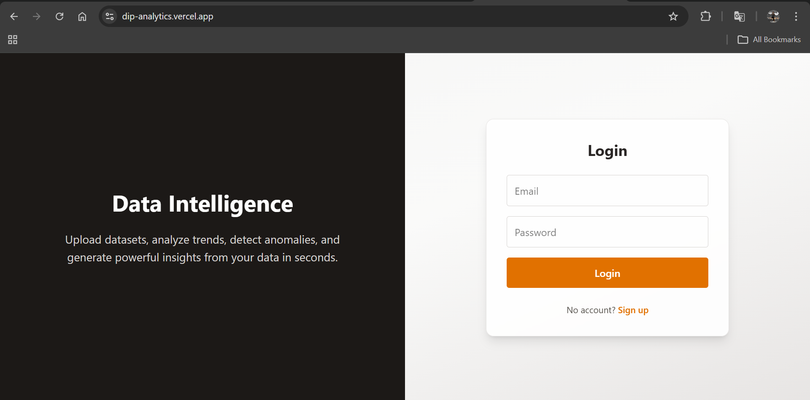
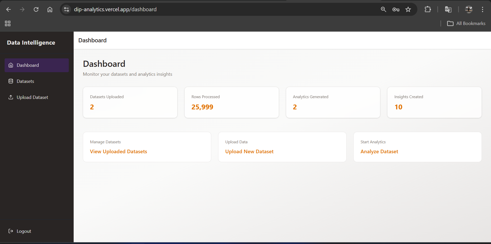
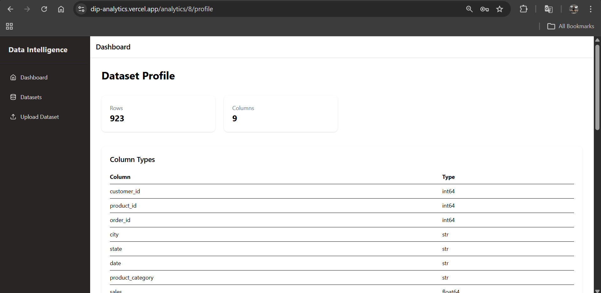
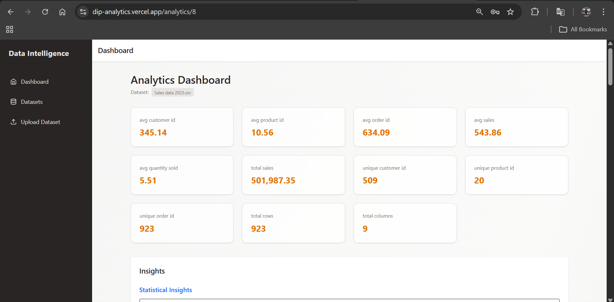
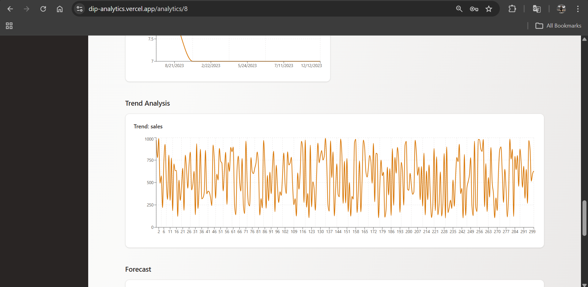
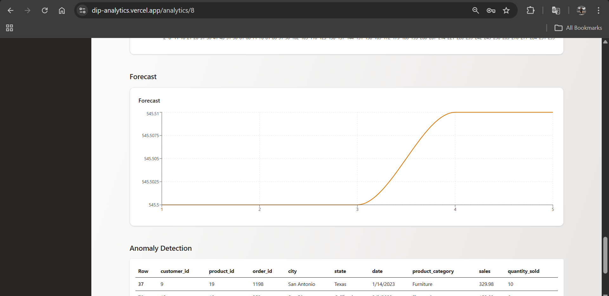
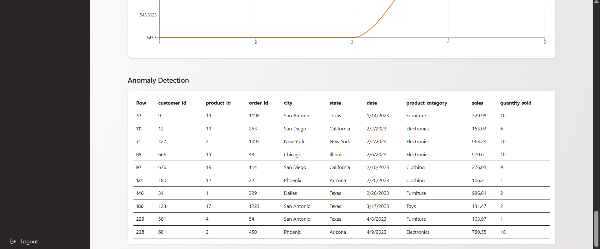

# 🚀 Unified Data Intelligence & Forecasting Platform


A Full-Stack Data Intelligence Platform that allows users to upload datasets and automatically generate insights, visualizations, anomaly detection, and forecasting through an interactive analytics dashboard.

The platform simplifies the data analysis workflow by combining data profiling, machine learning analytics, and visualization tools in a single application.

---

# 🌐 Live Application

Project  
https://dip-analytics.vercel.app

---

# ✨ Key Features

## 📂 Dataset Management

- Upload CSV and Excel datasets
- Preview dataset structure and rows
- Dataset metadata storage
- Dataset management and deletion

## 🔍 Automated Data Profiling

- Dataset size and structure analysis
- Column datatype detection
- Missing value analysis
- Correlation matrix generation
- Numeric summary statistics

## 🧹 Data Cleaning

- Duplicate removal
- Missing value handling
- Invalid numeric value correction
- Automatic datatype conversions

## 📊 Interactive Analytics Dashboard

- Distribution charts
- Category frequency analysis
- Correlation heatmaps
- KPI metrics
- Trend analysis

## 🤖 Machine Learning Analytics

- Anomaly Detection using Isolation Forest
- Trend Forecasting using regression models
- Automated statistical insights

## 🔐 Authentication & Security

- User signup and login
- JWT authentication
- Role-based access control

## ☁️ Cloud Deployment

Frontend: Vercel  
Backend: Render  
Database: Supabase PostgreSQL

---

# 🧠 System Architecture

React Frontend (Vercel)

↓

FastAPI Backend (Render)

↓

PostgreSQL Database (Supabase)

↓

Analytics Engine (Pandas + NumPy + Scikit-Learn)

---

# 🛠 Tech Stack

## Backend

- FastAPI
- SQLAlchemy
- PostgreSQL
- Pandas
- NumPy
- Scikit-Learn
- JWT Authentication

## Frontend

- React (Vite)
- Tailwind CSS
- Recharts
- Axios
- React Router

## Deployment

- Vercel
- Render
- Supabase

---

# 📷 Application Screenshots

Screenshots from the live deployed application.

### Login Page


### Dashboard


### Dataset Profile


### Analytics Dashboard


### Trend Analysis


### Forecasting


### Anomaly Detection


---

# 📂 Project Structure

backend

auth  
├── models.py  
├── routes.py  
└── schemas.py  

datasets  
├── models.py  
├── routes.py  
└── services.py  

analytics  
└── services.py  

core  
├── config.py  
├── database.py  
├── dependencies.py  
├── security.py  
└── permissions.py  

main.py  

frontend  

pages  
components  
context  

---

# ⚙️ Installation

## Clone Repository

```bash
git clone https://github.com/yourusername/data-intelligence-platform.git

cd data-intelligence-platform
```

---

## Backend Setup

```bash
cd backend

python -m venv venv

source venv/bin/activate

pip install -r requirements.txt

uvicorn main:app --reload
```

Backend runs at

```
http://localhost:8000
```

---

## Frontend Setup

```bash
cd frontend

npm install

npm run dev
```

Frontend runs at

```
http://localhost:5173
```

---

# 📡 API Endpoints

## Authentication

POST /users  
Create User (Signup)

POST /users/login  
User Login (JWT Authentication)

---

## Dataset Management

POST /datasets/upload  
Upload Dataset (CSV / Excel)

GET /datasets  
List All User Datasets

GET /datasets/{dataset_id}  
Get Dataset Metadata

GET /datasets/{dataset_id}/preview  
Preview Dataset

DELETE /datasets/{dataset_id}  
Delete Dataset

---

## Analytics Endpoints

GET /analytics/{dataset_id}/profile  
Generate Dataset Profile

GET /analytics/{dataset_id}/insights  
Generate Dataset Insights

GET /analytics/{dataset_id}/forecast  
Generate Forecast Predictions

POST /analytics/{dataset_id}/clean  
Clean Dataset

GET /analytics/{dataset_id}/charts  
Generate Chart Data

GET /analytics/{dataset_id}/kpis  
Generate KPI Metrics

GET /analytics/{dataset_id}/anomalies  
Detect Dataset Anomalies

GET /analytics/{dataset_id}/dashboard  
Generate Full Analytics Dashboard

---

## Utility Endpoints

GET /  
API Root Endpoint

GET /health  
Health Check Endpoint

GET /profile  
Get Current User Profile

GET /admin  
Admin Access Endpoint

GET /analytics-access  
Analytics Role Access Check

GET /dashboard-access  
Dashboard Role Access Check

---

# 🔮 Future Improvements

- AI generated business insights
- Natural language dataset querying
- Advanced time series forecasting
- AutoML model training
- Large dataset processing
- Export analytics reports (PDF / CSV)

---

# 👨‍💻 Author

**Lakshman Kumar Nanchari**

Python Backend Developer | React Developer | Data Analytics Enthusiast

GitHub:  
https://github.com/lakshman-nanchari

---

⭐ If you like this project, consider giving it a star on GitHub.
